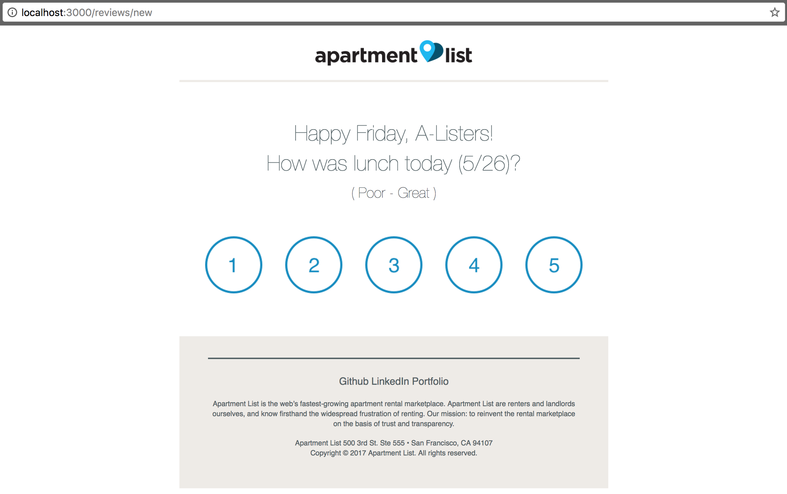
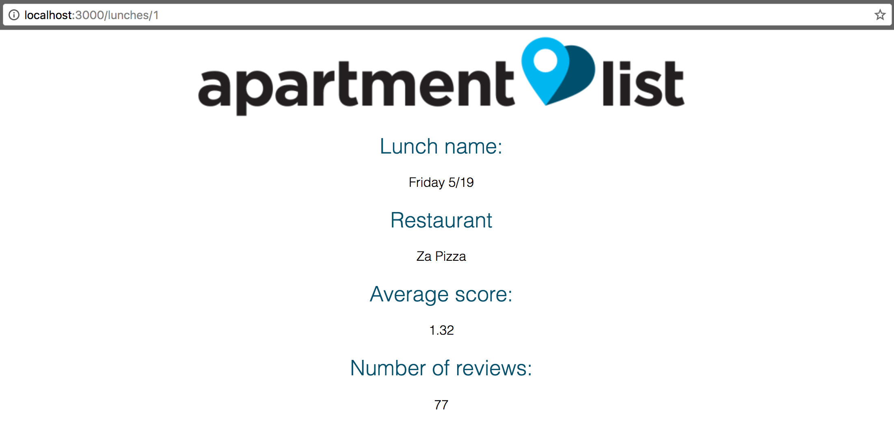

# Family Friday Demo

This repo builds a responsive email template to solicit feedback from teammates after Family Friday meals. Since information collected from the email can offer actionable insights, the email stores all relevant information to a database. As such, the email is realized in a Rails app with a PostgreSQL database.



## Class structure

To streamline the persistence of data captured, information is divided into four primary tables:
- `Restaurant`, which holds basic information of the Family Friday restaurant: logo, name, and yelp_link
- `User` (e.g., "A-Lister" or "member"), which captures vital information such as name, team, and email (how do teammates receive the email without an email address?)
- `Lunch`, which represents the Family Friday event itself. The lunch is tied to a restaurant_id as well as a unique name
- `Review`, originally designed to be a join-table for User and Lunch, but now also includes a column for rating

Models for these tables include relevant associations. For example, since the `Review` table holds a foreign key (`lunch_id`) that corresponds to a column in the `Lunch` table (no pun intended), a given review must belong to a lunch. Reversing this relationship, a lunch may have many reviews. A snippet of the `Lunch` model:

```ruby
# == Schema Information
#
# Table name: lunches
#
#  id            :integer          not null, primary key
#  name          :string           not null
#  restaurant_id :integer          not null
#  created_at    :datetime         not null
#  updated_at    :datetime         not null
#

class Lunch < ApplicationRecord
  belongs_to :restaurant

  has_many :reviews

  has_many :users,
    through: :reviews,
    source: :user

  validates :name, :restaurant_id, presence: true
  validates :name, uniqueness: true

  def average
    sum = 0
    self.reviews.each { |review| sum += review.rating }
    (sum.to_f/(self.reviews.count)).round(2)
  end
end
```

Additional features of the class structure are validations for non-null values for `restaurant_id`, as well as a custom method to aid in calculations of persisted data.

## Email function

As emails are opened in in diverse environments (mobile, tablet, desktop, Outlook, Gmail, etc.), the HTML email itself should be responsive. Formatting of the HTML email is constructed with the MJML framework.

**In the original implementation** of storing teammates' feedback in a database, each numbered button represented an HTML form. A `POST` request was sent upon submission, with hidden fields capturing the `rating`, `user_id`, and `lunch_id`.

```html
<form action="<%= reviews_url %>" method="POST">
  <input type="hidden" name="authenticity_token" value="<%= form_authenticity_token %>">
  <input type="hidden" name="review[user_id]" value="1">
  <input type="hidden" name="review[lunch_id]" value="1">
  <input type="hidden" name="review[rating]" value="5">
  <input src="http://res.cloudinary.com/instagramme/image/upload/v1495519201/imageedit_2_9784742962_dme227.png"
    type="image"
    style="border:none;border-radius:0px;display:block;outline:none;text-decoration:none;width:100%;height:auto;"
    width="80" />
</form>
```

If the form were viewed within the Rails app itself (i.e., not from an email), there would be no issues with this approach. The data would successfully commit to the database. However, since we expect to see the form as an HTML email, a POST request would be **not** be successful.

The reason for this is that when the user views the form to create their review, Rails generates a random `authenticity token`, stores it in the session, and keeps the value as a hidden input in the form (above). When the user submits the form, Rails checks for the authenticity token, compares it to the stored token, and only allows the POST request to continue if they match.

This helps prevent a CSRF attack, and bars users from submitting the form to the app without viewing the form within the app itself.

As such, **the current implementation is a `GET` request**. Each numbered button in the email now supplies query parameters within the URL for the GET request.

```html
<a href="<%= reviews_url %>?user_id=1&lunch_id=1&rating=1">
  
</a>
```

ReviewsController#create and routes were updated accordingly:

```ruby
# ...
class ReviewsController < ApplicationController
  def create
    @review = Review.create(
      user_id: params[:user_id],
      lunch_id: params[:lunch_id],
      rating: params[:rating]
      )
    render :show
  end
# ...
end
```

```ruby
Rails.application.routes.draw do
  resources :users, only: [:create]
  resources :lunches, only: [:create, :show]
  resources :restaurants, only: [:create]
  resources :reviews, only: [:new, :show]
  get 'reviews' => 'reviews#create'
end
```

## Analytics

Each lunch's `show` page offers information as to its feedback. Leveraging the aforementioned associations between the four classes, we are able to view insights for that lunch, including its average score and current number of reviews.



Restaurant names, for example, are available via its association to a particular lunch (i.e., the lunch must have a restaurant).

```html
<h2 class="label">Restaurant</h2>
<div class="info">
  <%= @lunch.restaurant.name %>
</div>
```

## Potential future release
* [ ] Deeper analytics: reviews to be viewable in table-format, with additional information per review (user name, details about the user, etc.)
* [ ] Additional database information: which teammate dined with which teammate?
* [ ] Availability of further comments for low scores -- discover why a certain Family Friday may not have been a pleasant experience
* [ ] Tests (RSpec)
